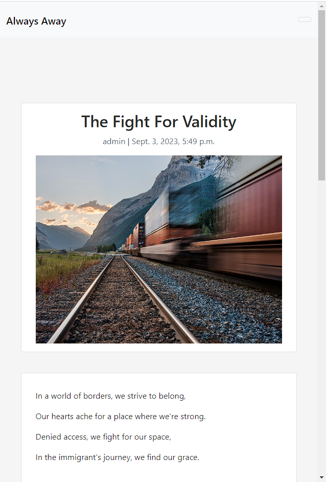
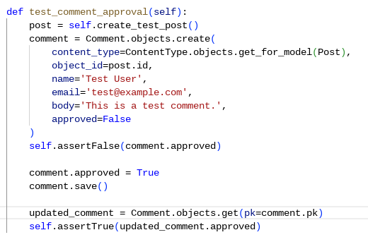
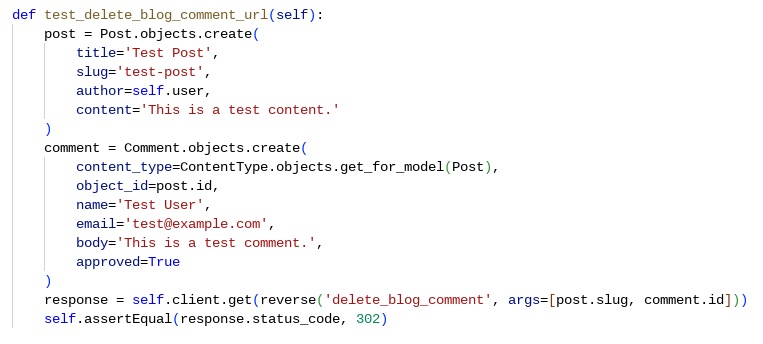

# <span id="overview"></span>Always Away


Always Away is a blog site, with the intention to create a community. The author is a long-term expatriot who wishes to create a safe space for users to share stories and feel a sense of camaraderie. Whether a fellow willing wanderer, displaced person, dreaming of the adventures, or simply intrigued by the stories of the migrating life - all are welcome.

View the live site by clicking [HERE](https://always-away-227aba88ca4e.herokuapp.com/).


# <span id="table-of-contents"></span> Table of Contents
- [_Always Away_](#overview)
- [_Contents menu_](#table-of-contents)
- [_UX_](#ux)
  - [_Site Purpose_](#purpose)
  - [_Site Goal_](#site-goal)
  - [_Target Audience_](#audience)
  - [_Modern Community_](#communication)
  - [_New User Goals_](#new-user-goals)
  - [_Current User Goals_](#current-user-goals)
  - [_Future User Goals_](#future-goals)
- [_Accessibility_](#accessibility)
- [_Agile Methodology_](#agile)
- [_User Stories_](#user-stories)
- [_Wireframes_](#wireframes)
- [_Features_](#features)
  - [_Navbar_](#navbar)
  - [_Footer/Social Media_](#footer)
  - [_Homepage_](#homepage)
  - [_Post Detail_](#post-detail)
  - [_Sign Up_](#signup)
  - [_Sign In_](#signin)
  - [_Sign Out_](#logout)
  - [_Upvote/Downvote_](#likes)
- [_C.R.U.D._](#crud)
  - [_Commenting_](#comments)
    - [_Create_](#cc)
    - [_Read_](#cr)
    - [_Update_](#cu)
    - [_Delete_](#cd)
  - [_Messaging_](#messaging)
    - [_Create_](#mc)
    - [_Read_](#mr)
    - [_Update_](#mu)
    - [_Delete_](#md)
- [_Technologies_](#tech)
  - [_Main Languages_](#languages)
  - [_Frameworks, Libraries, and Programs_](#frameworks)
  - [_Installed Packages_](#packages)
- [_Deployment_](#deployment)
  - [_Forking in Github_](#forking)
  - [_Running Local Environment_](#local)
  - [_Deploying to Heroku_](#heroku)
- [_Bugs_](#bugs)
  - [_Fixed Bugs_](#fixed)
  - [_Remaining Bugs_](#remaining)
- [_Testing_](#testing)
  - [_Python Manual Testing_](#manual)
  - [_Python Automated Testing_](#automated)
    - [_Models_](#models)
    - [_Views_](#views)
    - [_URLs_](#urls)
  - [_Javascript Testing_](#javascript)
- [_Credits_](#credits)
- [_Media_](#media)
- [_Team Members_](#team)

Always Away is a community blog site, written with the intention of sharing experiences and engaging with like-minded individuals. Here, I'll be sharing my personal journey and experiences as a long-term expatriot. Whether you're a fellow willing wanderer, displaced person, dreaming of the adventures in your own future, or simply intrigued by the stories of the migrating life, you are invited to join in to create an online community.

## <span id="ux"></span>UX

### <span id="purpose"></span>Site Purpose:
This site's intention is to create an online society. [Always Away](https://always-away-227aba88ca4e.herokuapp.com/) is meant to convey understanding, create community, and inspire a feeling of camaraderie amongst both strangers and friends.

### <span id="site-goal"></span>Site Goal:
The goal is to create a platform for online communication. The site intents to create an engaging experience to provide a modern sense of community in a growing and ever-alienating world. Where one neighborhood disappears in person, the site can provide digitally.

### <span id="audience"></span>Target Audience:
For citizens of the world with a thirst for adventure, the restless and onlookers alike. By having this avenue of online interaction, users will be able to get a taste of each other's experiences -  hopes, dreams, struggles, heartache...everything that compiles the life of a modern-day nomad or immigrant.

### <span id="communication"></span>Modern Community:
The worldwide web is a vital avenue of communication for modern day travelers, nomads, displaced persons, those left behind, or for any reason long-distance relationships. Without this form of computer-generated interaction, we would still be sending snail mail that may be lost after months in transit.

### <span id="new-user-goals"></span>New User Goals:
To intuitively navigate the site content, create account, and begin to engage with all there is to explore.

### <span id="current-user-goals"></span>Current User Goals:
Engage in the online community via comments or messaging to the site's author. For travellers to share their experiences
and possibly make a new friend along the way.

### <span id="future-goals"></span>Future Goals:
- To create a profile page for each user to have expanded capacity for sharing and interacting. 
- To implement functionality for users to post their own blog posts, including photos and text.
- To allow the site's admin to message individual users in response to their messages.
- To expand site's useability by categorizing posts and comments for users to easily be able to search for a spcific word or topic.

##### Back to [top](#table-of-contents)<hr>

### <span id="accessibility"></span>Accessibility and Design:

This Django blog project prioritizes functionality and a positive user experience. The decision to use the standard Django template was deliberate, with a focus on providing a reliable and efficient platform for users. The choice of a standard template ensures consistency across the site, making navigation intuitive and straightforward.

### Key Points:

- **Functionality First:** The primary goal was to build a blog that meets user needs, ensuring a seamless and efficient experience.
  
- **Usability and Accessibility:** Attention was given to usability, accessibility, and responsiveness to enhance the overall user experience.

- **Standard Template for Consistency:** The use of the standard Django template was intentional, providing a clean and uniform design throughout the site.

- **Color Contrast and Design:** Careful consideration was given to color contrast, and the overall color scheme contributes to a visually pleasing interface.

- **Future Customization:** The standard template sets the stage for future updates or customization without compromising the existing design.

- **Efficiency in Development:** Opting for the standard template allowed for efficient development, emphasizing core features without unnecessary complexity.

This approach reflects a balance between a user-centric design philosophy and efficient development practices.

##### Back to [top](#table-of-contents)<hr>

## <span id="agile"></span>Agile Methodology:
The principles of agile methodology were implemented during the project. By assigning user stories to Epics and Milestones, utilizing GitHub's Kanban board, the necessary project goals could be easliy prioritized.

### <span id="user-stories"></span>User Story Epics

1. **User Account Management**
- [X] I can register an account so that I can comment and like.
- [X] I can log in to my account and see my messages so that keep track of conversations with admin.
- [X] I can edit my comments so that I can more deeply interact with the community.
- [X] I can delete my own comments so that change my mind about a comment.

2. **Content Viewing and Interaction**
- [X] I can view a paginated list of pages so that I can easily select a page to view.
- [X] I can view a list of posts so that I can select one to read.
- [X] I can click on a post so that I can read the full text.
- [X] I can leave comments on a post so that I can be involved in the conversation.
- [X] I can view comments on an individual post so that I can read the conversation.
- [X] I can like or unlike a post so that I can interact with the content.
- [X] I can view the number of likes on each post so that I can see which is the most popular or viral.

3. **Messaging System**
- [X] I can create a draft message and save without sending so that I can take my time formulating a message over more than one site visit/login.
- [X] I can send a message to the admin so that I can interact with the creator of the blog.
- [X] I can delete messages so that I can clean out my inbox.

4. **Content Creation and Management (Admin)**
- [X] Admin can view comments on an individual post so that they can read the conversation.
- [X] Admin can leave comments on a post so that they can be involved in the conversation.
- [X] Admin can approve or disapprove comments so that they can filter out objectionable comments.
- [X] Admin can delete messages so that they can clean out their inbox.
- [X] Admin can view the number of likes on each post so that they can see which is the most popular or viral.
- [X] Admin can create draft posts so that they can finish writing the content later.
- [X] Admin can create, read, update, and delete posts so that they can manage blog content.

<hr>

The following User stories have not yet been implemented. They remain in the repository for the purpose of organizing future goals and projects - to expand and enhance the blog site.

- I can **make a blog post**
- I can **utilize a search capability** so that **I can easily locate specific topics or posts**
- I can **organize messages by category** so that **I can quickly search for a message I want to find**
- I can **upvote on comments** so that **earn Karma points, eventually rewarding me with badges or digital trophies**
- I can **mark a message as read** so that **my account can keep track for me if I have read a message or not**
- I can **use a reply function on messages** so that **I can continue a string of messages with admin**
- I can **utilize a search capability** so that **I can easily locate specific topics or posts**
- I can **categorize posts into sub-threads** so that **keep multiple posts organized**
- I can **send message to Users from admin panel** so that **I can more personally interact with site Users**
- I can **receive notifications** so that **I can see when someone likes or comments on my post**

##### Back to [top](#table-of-contents)<hr>

## <span id="wireframes"></span>Wireframes:
The combination of a textual mindmap and a [Lucidchart](https://www.lucidchart.com/pages/landing?utm_source=google&utm_medium=cpc&utm_campaign=_chart_en_tier2_mixed_search_brand_exact_&km_CPC_CampaignId=1520850463&km_CPC_AdGroupID=57697288545&km_CPC_Keyword=lucidchart&km_CPC_MatchType=e&km_CPC_ExtensionID=&km_CPC_Network=g&km_CPC_AdPosition=&km_CPC_Creative=442433237648&km_CPC_TargetID=kwd-33511936169&km_CPC_Country=1012293&km_CPC_Device=c&km_CPC_placement=&km_CPC_target=&gad_source=1&gclid=CjwKCAiAjrarBhAWEiwA2qWdCOSNG6sjJ3qs2nYVIIHwwbYKcWLE78MwEP-XwTdUHAvShv1Gm4uiiRoCjywQAvD_BwE) flowchart strikes a balance between clarity and visual representation. The textual mindmap ensures a quick, accessible overview, while the Lucidchart flowchart adds depth to user flows, fostering a comprehensive understanding of the blog's structure and interactions.

- Admin Panel
  - **Blog Management**
    - Create Blog
    - Edit Blog
    - Publish Blog
    - Save as Draft
    - Delete Blog
  - **Comment Supervision**
    - View Comments
  - **Message Reading**
    - Inbox
    - Draft Inbox
    - Sent Messages


- Front-End User Interaction
  - **Home Page**
    - Scrollable List of Published Blogs
  - **Navbar**
    - Register/Sign Up
    - Login
    - Logout
    - Home Page Navigation
  - **Authenticated User**
    - Inbox
    - Draft Message Inbox
    - Sent Messages Inbox
    - **Message Actions**
      - Send to Admin
      - Save as Draft
      - View Sent Messages
      - Delete Messages


##### Back to [top](#table-of-contents)<hr>

## <span id="features"></span>Features
### <span id="navbar"></span>Navbar

<details><summary>Desktop View while user is logged out/unregistered</summary>

</details>
<details><summary>Mobile View while user is authenticated and logged in</summary>

</details>

### <span id="footer"></span>Footer
<details><summary>Social Media</summary>

</details>

### <span id="homepage"></span>Homepage
<details><summary>On initial page load</summary>

</details>

### <span id="post-detail"></span>Post Detail View
<details><summary>Scrolling list of blog posts</summary>

</details>

### <span id="signup"></span>Sign Up
<details><summary>Sign up form</summary>

</details>

### <span id="signin"></span>Sign In
<details><summary>Sign in Form</summary>

</details>

### <span id="logout"></span>Sign out
<details><summary>Sign out form</summary>

</details>

### <span id="likes"></span>Liking/Unliking:
<details><summary>Heart icon</summary>

</details>

##### Back to [top](#table-of-contents)<hr>

## <span id="crud"></span>C.R.U.D.
### <span id="comments"></span>Commenting
#### <span id="cc"></span>Create:

<details><summary>Post Comment</summary>

</details>

#### <span id="cr"></span>Read:
<details><summary>View Comment</summary>

</details>

#### <span id="cu"></span>Update:

<details><summary>Edit Comment</summary>

</details>

#### <span id="cd"></span>Delete:

<details><summary>Delete Comment</summary>

</details>

<hr>

### <span id="messaging"></span>Messaging
#### <span id="mc"></span>Create:

<details><summary>Send Message</summary>

</details>

#### <span id="mr"></span>Read:

<details><summary>View Message</summary>

</details>

#### <span id="mu"></span>Update:

<details><summary>Edit Message</summary>

</details>

#### <span id="md"></span>Delete:

<details><summary>Delete Message</summary>

</details>

##### Back to [top](#table-of-contents)<hr>

## <span id="tech"></span>Technologies
### <span id="languages"></span>Main Languages:
- Python
- Javascript
- HTML5
- CSS3 + SVG

### <span id="frameworks"></span>Frameworks, Libraries, and Programs:
- [Python Built-in "os" Modules](https://docs.python.org/3/library/os.html)
- [Django](https://pypi.org/project/Django/3.2.14/)
- [Bootstrap + jQuery](https://getbootstrap.com/)
- [ElephantSQL](https://www.elephantsql.com/)
- [Cloudinary](https://cloudinary.com/ip/gr-sea-gg-brand-home-base?utm_source=google&utm_medium=search&utm_campaign=goog_selfserve_brand_wk22_replicate_core_branded_keyword&utm_term=1329&campaignid=17601148700&adgroupid=141182782954&keyword=cloudinary&device=c&matchtype=e&adposition=&gad=1&gclid=Cj0KCQjwgNanBhDUARIsAAeIcAunN7Ty8U3gZ7QFYnOuxM59Z22YZb6_bVmSwDBKKpWY2BvyYmsZHlUaAmkeEALw_wcB)
- [Google Fonts](https://fonts.google.com/)
- [Font Awesome](https://fontawesome.com/icons/instagram?s=solid&f=brands)
- [GitHub:](https://github.com/)
- [GitPod:](https://gitpod.io/)
- [Am I Responsive?](https://ui.dev/amiresponsive?url=https://krystalcoding.github.io/antisocial-dog-meetups/)
- [Favicon.io](https://favicon.io/)
- [Lucidchart Wireframing](https://www.lucidchart.com/pages/landing?utm_source=google&utm_medium=cpc&utm_campaign=_chart_en_tier2_mixed_search_brand_exact_&km_CPC_CampaignId=1520850463&km_CPC_AdGroupID=57697288545&km_CPC_Keyword=lucidchart&km_CPC_MatchType=e&km_CPC_ExtensionID=&km_CPC_Network=g&km_CPC_AdPosition=&km_CPC_Creative=442433237648&km_CPC_TargetID=kwd-33511936169&km_CPC_Country=1012293&km_CPC_Device=c&km_CPC_placement=&km_CPC_target=&gad_source=1&gclid=CjwKCAiAjrarBhAWEiwA2qWdCOSNG6sjJ3qs2nYVIIHwwbYKcWLE78MwEP-XwTdUHAvShv1Gm4uiiRoCjywQAvD_BwE)
 - [JSHint](https://jshint.com/)

### <span id="packages"></span>Installed Packages:
- 'django<4' gunicorn
- dj_database_url psycopg2
- dj3-cloudinary-storage
- django-summernote
- django-allauth
- django-crispy-forms

##### Back to [top](#table-of-contents)<hr>

## <span id="deployment"></span>Deployment
### <span id="forking"></span>Forking in Github:
1. Navigate to the [project repository](https://github.com/KrystalCoding/always-away)
2. Top Right menu > "Fork"
3. Clicking the Fork button automatically saves a copy of the repo on your own, logged-in Github page

### <span id="local"></span>Running locally:
1. Navigate to the [project repository](https://github.com/KrystalCoding/always-away)
2. Click on the top right, green "Code" button
3. Choose one of the three options (HTTPS, SSH or GitHub CLI) and then click copy
4. Open the terminal in your IDE program
5. Type git clone into your terminal and paste the URL that was copied in step 3
6. Hit Enter and your local clone will be created.

Alternatively - Use Gitpod:
1. Navigate to the [project repository](https://github.com/KrystalCoding/always-away
2. Hit the green "Gitpod" button and the project will automatically open up for you

### <span id="heroku"></span>Deploying to Heroku:
1. Create [Heroku](https://dashboard.heroku.com/) account
2. Install Django & Gunicorn via terminal command: ```pip3 install 'django<4' gunicorn```
3. Install Django database & psycopg:
```pip3 install dj_database_url psycopg2```
4. Install Cloudinary:
```pip3 install dj3-cloudinary-storage```
5. Creating the requirements.txt file with the following command:
```pip3 freeze --local > requirements.txt```
6. My django project was created using: ```django-admin startproject always-away .```
7. The blog app was then created with: ```python3 manage.py startapp blog```
8. This was then added to the" "settings.py" file within the project directory
9. The changes were then migrated using:
```python3 manage.py migrate```
10. Navigate to [Heroku](www.heroku.com) & created a new app called "always-away"
11. Add the Heroku Postgres database to the Resources tab
12. Navigate to the Settings tab and add the following key/value pairs to the configvars:

- key: SECRET_KEY | value: randomkey
- key: PORT | value: 8000
- key: CLOUDINARY_URL | value: API environment variable
- key: DATABASE_URL | value: value supplied by Heroku

13. Create an "env.py" file
14. Add the DATABASE_URL, SECRET_KEY & CLOUDINARY_URL to the "env.py" file
15.added the DATABASE_URL, SECRET_KEY & CLOUDINARY_URL to the "settings.py" file
16. Add the "import os" command at the top of the "env.py" file
17. Add Heroku to the ALLOWED_HOSTS in "settings.py"
18. Create a "Procfile"
19. Push the project to GitHub using commands ```git add .``` , ```git commit-m "Commit message"``` , ```git push```
20. Use the Deploy tab in Heroku to connect to the github repository
21. Click "Deploy"

##### Back to [top](#table-of-contents)<hr>

## <span id="bugs"></span>Bugs
### <span id="fixed"></span>Fixed Bugs:
* At first, I tried to connect posting, editing, and deleting messages to the comment Model and View. Once I realized this was stupid, I learned some things and re-focused the project.
* Static Files were not included and set up properly on deployment, but that was sorted.

### <span id="remaining"></span>Remaining Bugs:
* Footer is not sticking to the bottom of the screen below the forms.
* Message to ask user if they are sure they want to delete a message is not functioning. Code was removed from the repo for the sake of submitting the project, but it will be implemented eventually.
* Confirmation messages to let user know their messages were saved as a draft or sent successfully are not functioning. Again, code was removed temporarily.
* Unique photo upload to the blog posts via admin panel is not functioning and I do not currently know why, though the default image is being uploaded correctly.

##### Back to [top](#table-of-contents)<hr>

## <span id="testing"></span>Testing

1. Manual testing
2. Automated testing

### <span id="manual"></span> 1. Manual Testing

1. As a site User I can view a paginated list of pages so that I can easily select a page to view

**Step** | **Expected Result** | **Actual Result**
------------ | ------------ | ------------ |
| Click on the links (or hamburger icon on smaller screens) to intuitively access pagination via navigation bar | Nav bar drop down will open on smaller screens, and links will open to their associated pages. (See below for specific link functions) | Works as expected |
| Click on the Social Media icons link in the footer | Associated social media icons will load in a separate tab | Works as expected |
| Click on the 'Code Institute' or 'Django Framework' logos in the side panel | External tabs with associated websites will load | Works as expected |

<details><summary></summary>


</details>

9. As an Admin / Authorised User I can log in so that I can access the back end of the site

**Step** | **Expected Result** | **Actual Result**
------------ | ------------ | ------------ |
| Visit the admin page (ENTER LINK HERE)| Enter admin login credentials, gain access to back end | Works as expected |


<details><summary></summary>


</details>

3. As a Site Owner I can create and save draft blog posts, publish new blog posts, and edit formerly published posts.

**Step** | **Expected Result** | **Actual Result**
------------ | ------------ | ------------ |
| Click on Create new post | New Post form will appear | Works as expected |
| Click on save post as draft | Post is saved in admin panel for further updates | Works as expected |
| Click on publish post | New Post is published on front end for public viewing | Works as expected |
| Click on edit post in admin panel | Updates are published on front end for public viewing | Works as expected |


<details><summary></summary>


</details>

4. As a site User, I can register a personal account, access inbox, compose messages and save as drafts for further editing, and send messages to site admin.

**Step** | **Expected Result** | **Actual Result**
------------ | ------------ | ------------ |
| Click on the 'Register' link in the navigation bar | Sign up page will load| Works as expected |
| Click on the 'Sign in' link in the navigation bar | Login page will load| Works as expected |
| Click on the 'Contact' link in the navigation bar | Send Message to Admin form will load| Works as expected |
| Click on the 'Inbox' link in the navigation bar, or 'Primary Inbox' button in the Draft Inbox page | Inbox page will load | Works as expected |
| Click on the 'Draft Inbox' link in the navigation bar, or from the button in the Inbox page | Draft Inbox page will load| Works as expected |
| Click on the 'Logout' link in the navigation bar | Logout page will load| Works as expected |

<details><summary></summary>


</details>

2. As a site User, I can view blog post homepage, access individual posts for viewing content, comments, and likes. When logged in as a registered user, I can post my own comments and like posts.

**Step** | **Expected Result** | **Actual Result**
------------ | ------------ | ------------ |
 | Click on 'Blog Home' and scroll to footer at bottom of page | View blog home page in full length, all the way to the footer | Works as expected |
 | Click on individual posts to view content, including comments and likes | Opens individual post with scrolling function | Works as expected |
 | Click on like button | Page refreshes and updates icon via user's action of either liking or unliking a post | Works as expected |
 | Write comment and post with button | Page refreshes with comment + ability for user to edit or delete their own comment | Works as expected |

<details><summary></summary>


</details>

5. As a site Owner, I can approve or delete user comments from blog posts.

**Step** | **Expected Result** | **Actual Result**
------------ | ------------ | ------------ |
| Click on 'Comments' in admin panel| Choose to approve or delete user comments | Works as expected |

<details><summary></summary>


</details>

##### Back to [top](#table-of-contents)<hr>

### <span id="automated"></span> 2. Automated testing

- Python testing was done using the built in Django module, unittest.
- Javascript testing was done using JsHint.

### Test Models (test_models.py)
<details><summary>Pass Status</summary>

</details>

#### <span id="models"></span> BlogModelTests Class

1. **setUp**
   - **Purpose/Function:** Set up a test user for use in subsequent test cases.
   - **How it passes:** Creates a test user with a username and password.

2. **create_test_post**
   - **Purpose/Function:** Helper method to create a test blog post.
   - **How it passes:** Creates a test post with specified attributes.

3. **test_create_post**
   - **Purpose/Function:** Tests if a blog post is created successfully.
   - **How it passes:** Calls `create_test_post` and asserts that the post is created with the expected attributes.
      <details><summary>Create Post Test</summary>
      
      </details>

4. **test_create_comment**
   - **Purpose/Function:** Tests if a comment on a blog post is created successfully.
   - **How it passes:** Creates a test post, creates a comment on that post, and asserts that the comment is created with the expected attributes.
      <details><summary>Create Comment Test</summary>
      
      </details>

5. **test_comment_approval**
   - **Purpose/Function:** Tests if a comment can be marked as approved.
   - **How it passes:** Creates a test post, creates an unapproved comment on that post, marks the comment as approved, and asserts that the comment's approval status is updated.
         <details><summary>Comment Approval Test</summary>
      
      </details>

##### Back to [top](#table-of-contents)<hr>

### <span id="views"></span> Test Views (test_views.py)
<details><summary>Pass Status</summary>

</details>

#### BlogViewsTests Class

1. **setUp**
   - **Purpose/Function:** Set up a test user for use in subsequent test cases.
   - **How it passes:** Creates a test user with a username and password.

2. **test_post_list_view**
   - **Purpose/Function:** Tests if the post list view returns a successful response.
   - **How it passes:** Sends a GET request to the home page and asserts a 200 status code.
         <details><summary>Post List Test</summary>
      
      </details>

3. **test_post_detail_view**
   - **Purpose/Function:** Tests if the post detail view returns a successful response.
   - **How it passes:** Creates a test post, generates the URL for the post detail view, sends a GET request, and asserts a 200 status code.
         <details><summary>Post Detail Test</summary>
      
      </details>

4. **test_edit_blog_comment_view**
   - **Purpose/Function:** Tests if the edit blog comment view redirects appropriately.
   - **How it passes:** Creates a test post and comment, sends a GET request to the edit blog comment view, and asserts a 302 status code.
         <details><summary>Edit Blog Comment Test</summary>
      
      </details>

5. **test_delete_blog_comment_view**
   - **Purpose/Function:** Tests if the delete blog comment view redirects appropriately.
   - **How it passes:** Creates a test post and comment, sends a GET request to the delete blog comment view, and asserts a 302 status code.
         <details><summary>Delete Blog Comment Test</summary>
      
      </details>

6. **test_post_like_view**
   - **Purpose/Function:** Tests if the post like view redirects appropriately.
   - **How it passes:** Logs in a test user, creates a test post, sends a POST request to the post like view, and asserts a 302 status code.
         <details><summary>Post Like Test</summary>
      
      </details>

##### Back to [top](#table-of-contents)<hr>

### <span id="urls"></span> Test URLs (test_urls.py)

<details><summary>Pass Status</summary>

</details>

#### BlogURLTests Class

1. **setUp**
   - **Purpose/Function:** Set up a test user for use in subsequent test cases.
   - **How it passes:** Creates a test user with a username and password.

2. **test_post_list_url**
   - **Purpose/Function:** Tests if the post list URL returns a successful response.
   - **How it passes:** Sends a GET request to the home page URL and asserts a 200 status code.
         <details><summary>Post List Test</summary>
      
      </details>

3. **test_post_detail_url**
   - **Purpose/Function:** Tests if the post detail URL returns a successful response.
   - **How it passes:** Creates a test post, generates the URL for the post detail view, sends a GET request, and asserts a 200 status code.
         <details><summary>Post Detail Test</summary>
      
      </details>

4. **test_edit_blog_comment_url**
   - **Purpose/Function:** Tests if the edit blog comment URL redirects appropriately.
   - **How it passes:** Creates a test post and comment, generates the URL for the edit blog comment view, sends a GET request, and asserts a 302 status code.
      <details><summary>Edit Blog Comment Test</summary>
      
      </details>

5. **test_delete_blog_comment_url**
   - **Purpose/Function:** Tests if the delete blog comment URL redirects appropriately.
   - **How it passes:** Creates a test post and comment, generates the URL for the delete blog comment view, sends a GET request, and asserts a 302 status code.
         <details><summary>Delete Blog Comment Test</summary>
      
      </details>


##### Back to [top](#table-of-contents)<hr>


### <span id="javascript"></span> Javascript Testing

**Automated Test 1: Timeout Function**
- **Description:**
This automated test passes JSHint successfully. It utilizes vanilla JavaScript to set a timeout function, which selects the close button within an element with the class "alert" and triggers a click event after 2000 milliseconds. The code ensures automatic closure of an alert.

<details><summary>Timeout Code</summary>

</details>
<br>

**Step** | **Expected Result** | **Actual Result**
------------ | ------------ | ------------ |
| Execute the JavaScript timeout function | The function should find the close button for an alert with the class `.alert` and trigger a click event after a delay of 2000 milliseconds | Passes JSHint and works as expected. The setTimeout function triggers a click on the close button after a delay, simulating the automatic closure of an alert. |

**Automated Test 2: Fade Away Function**
- **Description:**
This automated test successfully passes JSHint. It employs jQuery to fade out elements with the class "alert" after a delay of 2000 milliseconds. The use of "$" in this code is due to jQuery being embedded in HTML, indicating the successful integration of jQuery.

<details><summary>Fade Away Code</summary>

</details>
<br>

**Step** | **Expected Result** | **Actual Result**
------------ | ------------ | ------------ |
| Execute the JavaScript timeout function with jQuery | The function should select all elements with the class `.alert` and fade them out slowly after a delay of 2000 milliseconds | Passes JSHint and works as expected. The setTimeout function, combined with jQuery, fades out elements with the class `.alert`` after a delay, providing a visual fade-away effect. |

##### Back to [top](#table-of-contents)<hr>

## <span id="credits"></span>Credits
* Martina Terlevic: Code Institute Mentor and center of sanity.
* Code Institute's walkthrough Django project, called [_I think therefore I blog_](https://github.com/Code-Institute-Solutions/Django3blog/tree/master), for basic repository set up and starter Django project code.
* Clueless Biker's github project ["print(STATEMENTS)"](https://github.com/CluelessBiker/project4-print-statements) for the README.md inspiration.
* ErikHgm's github project ["FireHouse Restaurant"](https://github.com/ErikHgm/FireHouse-Restaurant-Project) for README.md inspiration.
* Code Institute's tutors, and fellow students on Slack for degugging
* [Stack Overflow](https://try.stackoverflow.co/explore-teams?utm_source=adwords&utm_medium=ppc&utm_campaign=kb_teams_search_brand_emea-dach&_bt=657236278306&_bk=stack+overflow&_bm=p&_bn=g&gclid=Cj0KCQjwgNanBhDUARIsAAeIcAt8RyvjI8QiLAj3kyl-W8hBXwtXekioNxfa6XQ9uT2fIyg7jq52MJMaAqKQEALw_wcB) for coding solutions when I was terribly stuck.

##### Back to [top](#table-of-contents)<hr>

## <span id="media"></span>Media

* [_Pexels_](https://www.pexels.com/)
    - Photos by: 
      - Alex Azabache
      - Cottonbro Studio
      - Adrian Vieriu
      - James Wheeler
      - Krampus Production
      - Ketut Subiyanto
      - Matt Barnard

*  [_Cloudinary_](https://cloudinary.com/) photo hosting platform

## <span id="team"></span>Team Members

| Name                | LinkedIn                                                                                    | GitHub                                                                                    |
|---------------------|---------------------------------------------------------------------------------------------|-------------------------------------------------------------------------------------------|
| Krystal Juvrud | [](https://www.linkedin.com/in/krystal-juvrud/)             | [](https://github.com/KrystalCoding)               |


##### Back to [top](#table-of-contents)<hr>
